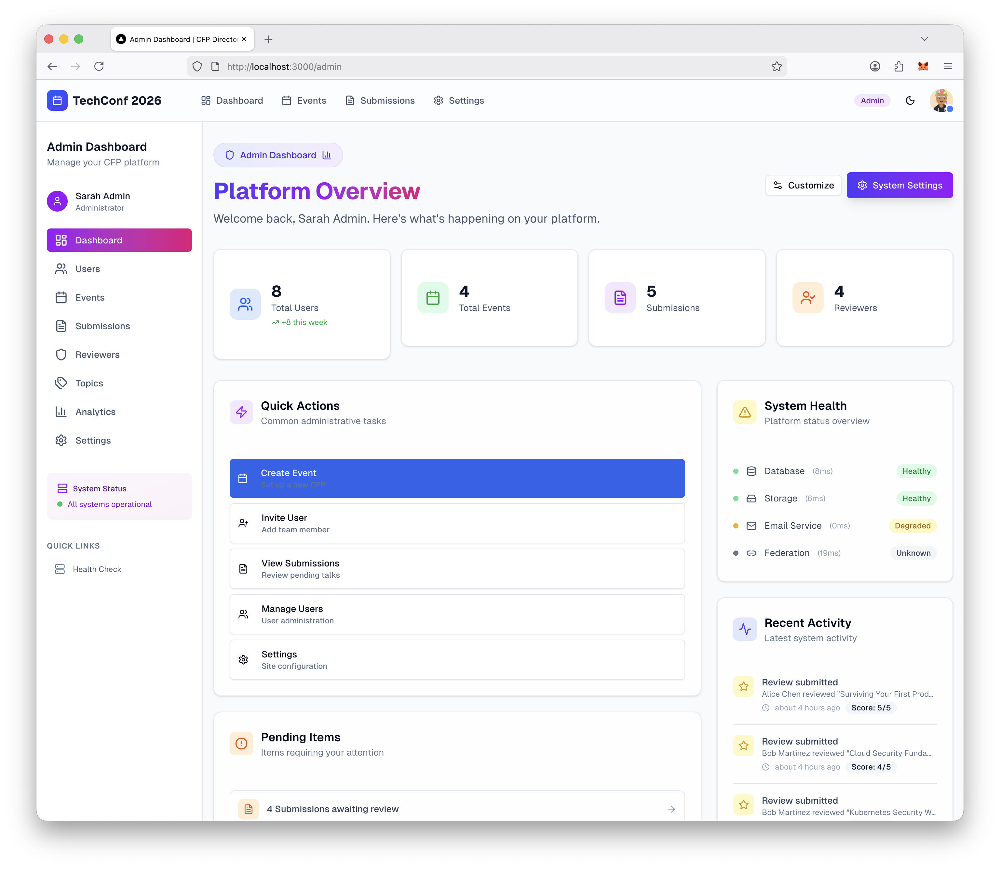
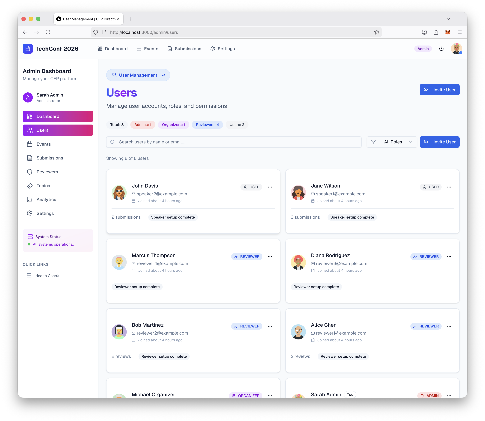
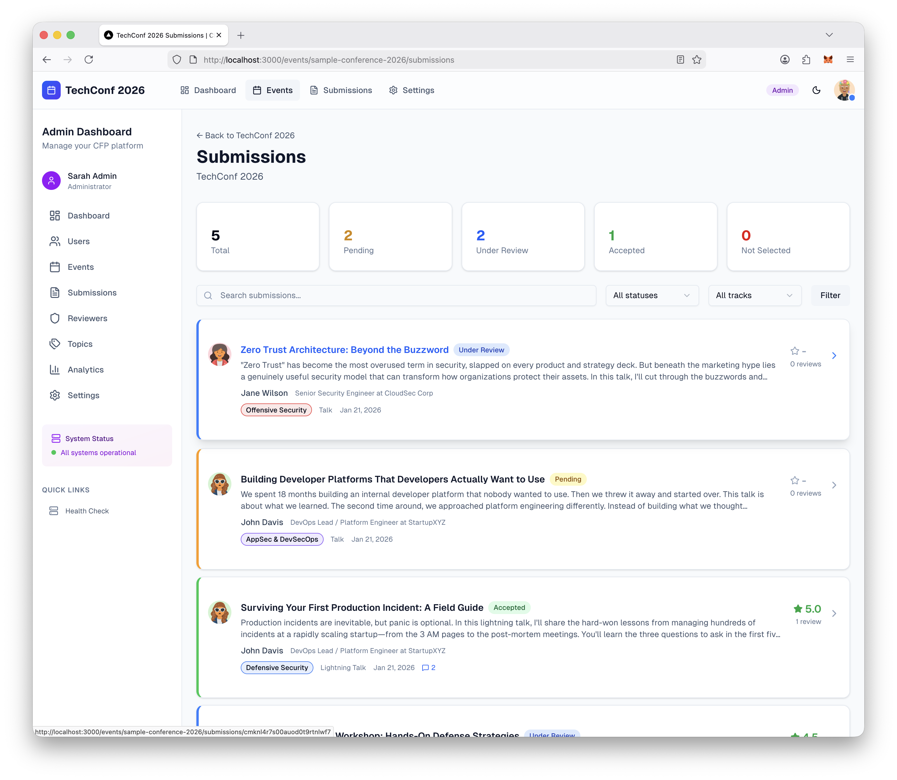
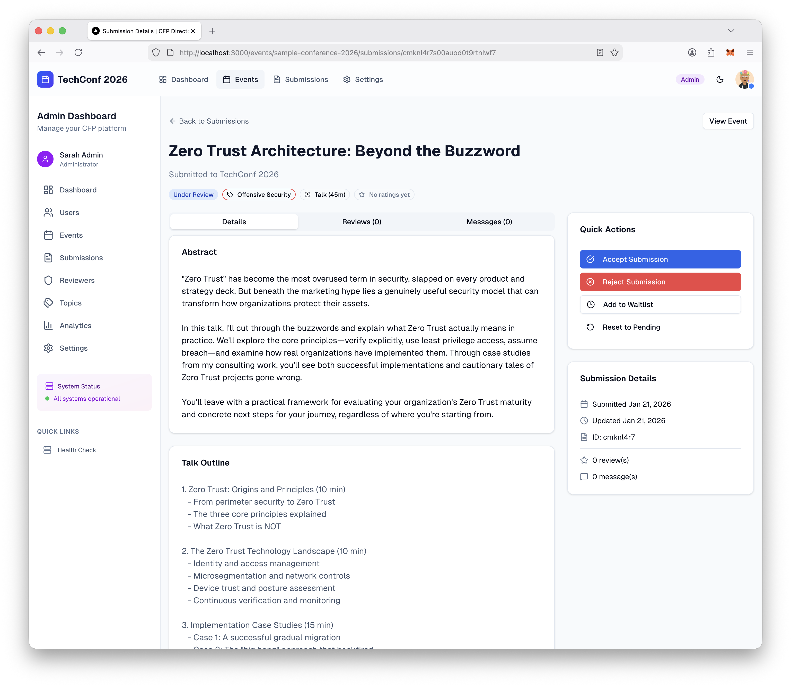
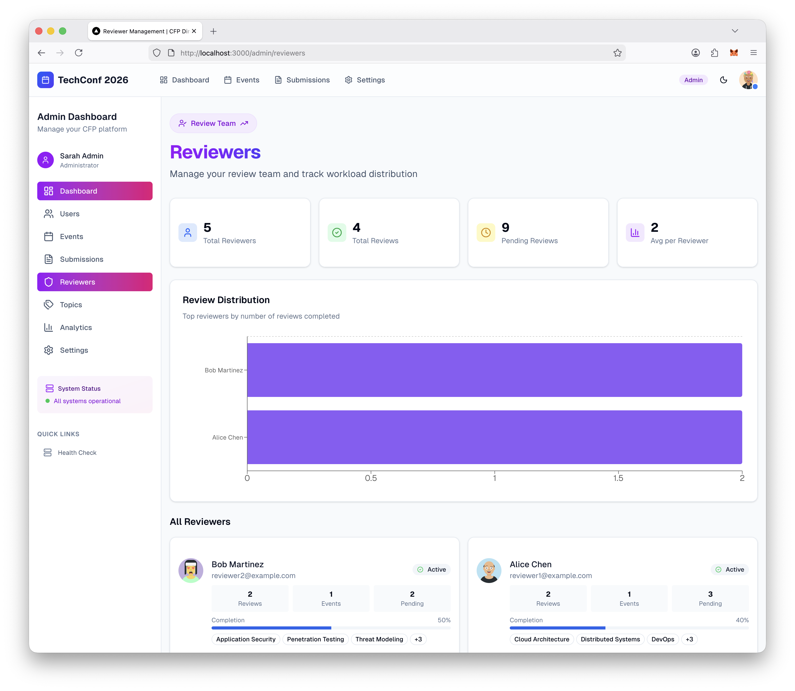

# CFP Directory Self-Hosted

Open-source Call for Papers (CFP) management platform with **enterprise-grade security**. Run your own CFP system with optional federation to [cfp.directory](https://cfp.directory).

> **Industry-Leading Security**: The only self-hosted CFP system with end-to-end encryption, PKI-based federation, and zero-knowledge architecture. Your speaker data is protected at rest, in transit, and during federated exchange.

---

## Quick Start

Get up and running in under 5 minutes.

### One-Command Setup (Recommended)

```bash
git clone https://github.com/l33tdawg/cfp-directory-self-hosted.git
cd cfp-directory-self-hosted
make quick-start
```

This automatically:
- Checks prerequisites (Docker, Docker Compose)
- Generates secure secrets for authentication and database
- Creates the `.env` configuration file
- Builds and starts Docker containers
- Runs database migrations
- Seeds essential data (topics, email templates, and settings)
- Waits for the application to be healthy

Then open http://localhost:3000/setup to create your admin account.

> **Security Note**: Public registration is disabled by default. The first admin must be created via the setup wizard at `/setup`. See [Security Configuration](#security-configuration) for details.

### Load Demo Data (Optional)

Topics and categories are automatically seeded on fresh installs. To also load demo data for exploring the platform:

```bash
# Full demo data (sample events, users, submissions, reviews)
make seed
```

**Demo accounts** (password: `password123`):
- `admin@example.com` - Admin user
- `organizer@example.com` - Event organizer
- `reviewer1@example.com` - Reviewer
- `speaker1@example.com` - Speaker

### Interactive Setup

For more control over configuration:

```bash
git clone https://github.com/l33tdawg/cfp-directory-self-hosted.git
cd cfp-directory-self-hosted
make setup
```

The interactive wizard guides you through:
- Application name and URL configuration
- Database password (auto-generated or custom)
- Docker or local development setup
- Database migrations and seeding

> **Note**: Email/SMTP settings are configured via the web interface at **Settings > Email** after installation.

### Verify Installation

```bash
make check
```

---

## Requirements

- **Docker** and **Docker Compose** v2 (for production)
- **Node.js 18+** and **npm** (for local development)
- **PostgreSQL 14+** (included in Docker setup)

---

## Security-First Architecture

Unlike other CFP platforms, we've built security into every layer.

### Data Protection

| Layer | Protection | Technology |
|-------|------------|------------|
| **At Rest** | PII encrypted in database | AES-256-GCM |
| **In Transit** | All connections encrypted | TLS 1.3 |
| **Federation** | End-to-end encrypted payloads | RSA-2048 + AES-256-GCM (Hybrid) |
| **Webhooks** | Tamper-proof + replay protection | HMAC-SHA256 + timestamps |

### Zero-Knowledge Federation

When you enable federation with cfp.directory:

1. **You generate RSA-2048 keypair** on your server - private key never leaves your system
2. **Public key registered** with cfp.directory - only used to encrypt data sent to you
3. **Speaker data encrypted** before leaving cfp.directory - even cfp.directory can't read it after encryption
4. **Only your server can decrypt** using the private key - true end-to-end encryption

For compliance-conscious organizations, our security architecture supports GDPR, SOC 2, and other regulatory requirements for handling speaker PII.

---

## Features

### Core Features (Free and Open Source)

- **Event Management** - Create and manage multiple events with customizable CFP settings
- **Submission System** - Accept talk proposals with materials, co-speakers, and custom fields
- **Review System** - Assign reviewers, score submissions, and collaborate on decisions
- **Messaging** - Communicate with speakers about their submissions
- **User Management** - Role-based access (Admin, Organizer, Reviewer, Speaker)
- **Email System** - Database-driven SMTP configuration and customizable email templates
- **Topic Management** - Admin-configurable topic taxonomy for talks and reviewer expertise
- **Security Built-In** - AES-256-GCM encryption for sensitive data at rest

### Federation Features (Requires License)

- **Speaker Network** - Connect to cfp.directory's global speaker network
- **One-Click Submissions** - Speakers on cfp.directory can submit with their existing profiles
- **Bidirectional Messaging** - Communicate across platforms seamlessly
- **Automatic Profile Sync** - Speaker data synced with explicit consent
- **End-to-End Encryption** - Speaker data encrypted with your public key before transmission

---

## Screenshots

Get a preview of what CFP Directory Self-Hosted looks like in action.

<details>
<summary>Click to expand screenshots</summary>

### Admin Dashboard


### User Management


### Submissions List


### Submission Details


### Reviewer Management


</details>

---

## Make Commands

| Command | Description |
|---------|-------------|
| `make quick-start` | One-command setup with secure defaults |
| `make setup` | Interactive setup wizard |
| `make check` | Verify prerequisites and installation |
| `make start` | Start Docker containers |
| `make stop` | Stop Docker containers |
| `make restart` | Restart Docker containers |
| `make logs` | View application logs |
| `make shell` | Open shell in app container |
| `make db-shell` | Open PostgreSQL shell |
| `make seed` | Seed database with demo data (users, events, etc.) |
| `make seed-minimal` | Re-seed topics and email templates only |
| `make db-migrate` | Run pending database migrations |
| `make db-reset` | Reset database (deletes all data) |
| `make backup` | Create database and uploads backup |
| `make restore BACKUP=path` | Restore from backup |
| `make update` | Pull latest changes and rebuild |
| `make clean` | Remove containers and volumes |
| `make help` | Show all available commands |

---

## Configuration

### Required Environment Variables

| Variable | Description | Example |
|----------|-------------|---------|
| `NEXTAUTH_SECRET` | Secret for session encryption (min 32 chars) | Auto-generated by setup |
| `ENCRYPTION_KEY` | Master key for PII encryption (min 32 chars) | Auto-generated by setup |
| `DB_PASSWORD` | Database password (Docker mode) | Auto-generated by setup |

> **⚠️ CRITICAL - Backup Your Encryption Key!**
>
> The `ENCRYPTION_KEY` encrypts all PII (Personally Identifiable Information) stored in the database. **If you lose this key, encrypted data CANNOT be recovered!**
>
> After setup, immediately copy your `ENCRYPTION_KEY` from the `.env` file and store it securely:
> - Password manager (1Password, Bitwarden, etc.)
> - Secure vault (HashiCorp Vault, AWS Secrets Manager, etc.)  
> - Encrypted backup
>
> Generate a new key manually: `openssl rand -base64 32`

### Application Settings

| Variable | Description | Default |
|----------|-------------|---------|
| `APP_NAME` | Your CFP platform name | `CFP Directory Self-Hosted` |
| `APP_URL` | Public URL for emails and links | `http://localhost:3000` |
| `APP_PORT` | Application port | `3000` |
| `MAX_FILE_SIZE_MB` | Maximum upload file size | `100` |

### Email Configuration

Email (SMTP) settings are configured through the web interface, not environment variables.

1. Go to **Settings > Email** in your admin dashboard
2. Enter your SMTP server details (host, port, username, password)
3. Configure sender name and email address
4. Use **Test Connection** to verify settings
5. Send a test email to confirm delivery

**Email Templates**: All system emails (welcome, password reset, submission status, etc.) can be customized at **Admin > Email Templates**. Templates support:
- Rich HTML content
- Variable placeholders (e.g., `{userName}`, `{eventName}`)
- Preview with sample data
- Enable/disable individual templates

Common SMTP providers:
| Provider | Host | Port | Notes |
|----------|------|------|-------|
| Gmail | `smtp.gmail.com` | 587 | Requires App Password |
| SendGrid | `smtp.sendgrid.net` | 587 | Use API key as password |
| Mailgun | `smtp.mailgun.org` | 587 | Domain-specific credentials |
| Amazon SES | `email-smtp.[region].amazonaws.com` | 587 | IAM credentials |

### Security Configuration

| Variable | Description | Default |
|----------|-------------|---------|
| `ENCRYPTION_KEY` | Master key for PII encryption | Auto-generated |
| `ENCRYPT_PII_AT_REST` | Encrypt all PII in database | `true` (production) |
| `SETUP_TOKEN` | Required token for initial admin setup | Auto-generated |
| `ALLOW_PUBLIC_SIGNUP` | Allow public user registration | `false` |
| `TRUST_PROXY_HEADERS` | Trust reverse proxy headers for IP | `false` |
| `TRUSTED_PROXY_COUNT` | Number of trusted proxies in chain | `1` |
| `CRON_SECRET` | Secret for scheduled job endpoints | Auto-generated |

> **Fresh Install Security**: By default, public registration is **disabled** to prevent attackers from racing to create the first admin account on fresh deployments. The initial admin must be created via:
> 1. The setup wizard at `/setup` (uses `SETUP_TOKEN` for authentication)
> 2. Or by setting `ALLOW_PUBLIC_SIGNUP=true` (not recommended for production)
>
> The `SETUP_TOKEN` is auto-generated during setup. For production deployments exposed to the internet, always use a strong `SETUP_TOKEN` and complete setup immediately after deployment.

> **Full PII Encryption**: All personally identifiable information is encrypted at rest:
> 
> | Model | Encrypted Fields |
> |-------|-----------------|
> | **User** | name |
> | **Speaker Profile** | fullName, bio, location, company, position, social links, photo |
> | **Reviewer Profile** | fullName, designation, company, bio, social links, photo |
> | **Federated Speaker** | email, name, bio, location, company, all profile data |
>
> *Note: User email is not encrypted as it's required for authentication lookups. Email protection should be handled at the database/infrastructure level.*
>
> **Encryption Details**: 
> - Algorithm: AES-256-GCM (authenticated encryption)
> - Key derivation: PBKDF2 with 100,000 iterations
> - Each value has a unique IV and salt
> - Encrypted fields are prefixed with `enc:v1:` for identification

### Federation Configuration (Optional)

| Variable | Description |
|----------|-------------|
| `FEDERATION_LICENSE_KEY` | License key from cfp.directory |
| `CFP_DIRECTORY_API_URL` | Federation API URL (default: `https://cfp.directory/api/federation/v1`) |

---

## Local Development

For development without Docker:

```bash
# Clone and enter directory
git clone https://github.com/l33tdawg/cfp-directory-self-hosted.git
cd cfp-directory-self-hosted

# Interactive setup for local development
make setup-local

# Or manually:
npm install
cp .env.example .env
# Edit .env with your PostgreSQL connection string
npx prisma generate
npx prisma migrate deploy
npm run dev
```

### Development Commands

```bash
make install    # Install npm dependencies
make dev        # Start development server
make test       # Run tests
make lint       # Run linter
make build      # Build for production
```

### Development with Docker

For Docker-based development with hot-reloading:

```bash
make dev-docker
```

This includes:
- Hot-reloading of source files
- Exposed database port (5432)
- Adminer database UI at http://localhost:8080

---

## Health Checks

The application exposes a health endpoint at `/api/health`:

```bash
# Basic health check (public)
curl http://localhost:3000/api/health
```

Response:
```json
{
  "status": "healthy",
  "timestamp": "2024-01-01T00:00:00.000Z",
  "version": "0.1.0",
  "environment": "production",
  "database": "connected"
}
```

For detailed health information (includes latency, configuration status), authentication is required:

```bash
# Detailed health check (requires CRON_SECRET or admin session)
curl -H "x-cron-secret: YOUR_CRON_SECRET" "http://localhost:3000/api/health?detailed=true"
```

---

## Backup and Restore

> **⚠️ Important**: Backups contain encrypted PII data. You MUST keep your `ENCRYPTION_KEY` safe to restore and read this data. Always backup your `.env` file alongside database backups!

### Creating Backups

```bash
make backup
# Or: ./scripts/backup.sh /path/to/backups
```

Backups include:
- PostgreSQL database dump (custom and SQL formats)
- Uploaded files
- Metadata (timestamp, version)
- Encryption key reminder file

### Restoring Backups

```bash
make restore BACKUP=./backups/cfp-backup-20240101_120000.tar.gz
```

### Automated Backups

Set up a cron job for production:

```bash
# Daily backup at 2 AM
0 2 * * * /path/to/cfp-directory-self-hosted/scripts/backup.sh /path/to/backups
```

---

## Federation

Federation connects your self-hosted instance to cfp.directory's global speaker network.

### Setting Up Federation

1. Go to **Settings > Federation** in your admin dashboard
2. Click **Generate Encryption Keypair** to create your RSA-2048 keypair
3. Copy the **Public Key** displayed
4. Go to [cfp.directory/pricing](https://cfp.directory/pricing) and purchase a license
5. During registration, paste your public key
6. Copy the license key you receive
7. Back in your dashboard, enter the license key and click **Save License Key**
8. Enable the federation toggle once validated
9. Go to each event and enable federation individually

### What Federation Enables

- Your events appear in cfp.directory's federated events directory
- Speakers on cfp.directory can submit to your events with one click
- Speaker profiles are synced automatically (with consent)
- Submission status updates are sent back to speakers
- Bidirectional messaging between organizers and speakers

### Federation Heartbeat

For production, set up a periodic heartbeat:

```bash
# Add to crontab (runs every hour)
0 * * * * curl -X POST -H "x-cron-secret: YOUR_CRON_SECRET" http://localhost:3000/api/federation/heartbeat
```

---

## Upgrading

```bash
make update
```

Or manually:

```bash
git pull origin main
docker compose build --no-cache
docker compose up -d
```

---

## Troubleshooting

### Container Won't Start

```bash
# Check logs
make logs

# Common issues:
# - NEXTAUTH_SECRET not set (run make setup)
# - Database not ready (wait a few seconds)
# - Port 3000 already in use
```

### Database Connection Issues

```bash
# Check database is running
docker compose ps

# Check database logs
docker compose logs db

# Test connection
docker exec -it cfp-db psql -U cfp -d cfp -c "SELECT 1"
```

### Reset Everything

```bash
# WARNING: This deletes all data!
make clean
make quick-start
```

---

## Project Structure

```
cfp-directory-self-hosted/
├── docker/                    # Docker configuration
│   ├── Dockerfile             # Multi-stage production build
│   └── docker-compose.dev.yml # Development overrides
├── prisma/                    # Database schema and migrations
│   ├── schema.prisma          # Prisma schema
│   ├── seed.ts                # Database seeding
│   └── seed-topics.ts         # Security conference topics
├── scripts/                   # Utility scripts
│   ├── setup.sh               # Interactive setup wizard
│   ├── quick-start.sh         # One-command setup
│   ├── backup.sh              # Database and uploads backup
│   └── restore.sh             # Restore from backup
├── src/
│   ├── app/                   # Next.js App Router
│   │   ├── (auth)/            # Authentication pages
│   │   ├── (dashboard)/       # Dashboard pages
│   │   └── api/               # API routes
│   ├── components/            # React components
│   │   ├── ui/                # shadcn/ui components
│   │   ├── auth/              # Auth components
│   │   ├── admin/             # Admin components
│   │   └── events/            # Event components
│   ├── lib/                   # Utilities and services
│   │   ├── auth/              # NextAuth.js config
│   │   ├── db/                # Prisma client
│   │   ├── email/             # Email service
│   │   ├── crypto/            # Encryption utilities
│   │   └── validations/       # Zod schemas
│   └── hooks/                 # React hooks
├── docker-compose.yml         # Root compose file
├── Makefile                   # Make shortcuts
└── .env.example               # Environment template
```

---

## Contributing

Contributions are welcome! Please see [CONTRIBUTING.md](CONTRIBUTING.md) for guidelines.

---

## License

Copyright 2024-present Dhillon Andrew Kannabhiran / CFP Directory

This project is licensed under the Apache License 2.0 - see the [LICENSE](LICENSE) file for details.

### Attribution Requirement

**You must display "Powered by CFP Directory" with a link to https://cfp.directory in the footer of all public-facing pages.** This is required by the [NOTICE](NOTICE) file under Apache 2.0 Section 4(d).

This attribution must:
- Be clearly visible to users
- Include a hyperlink to https://cfp.directory
- Not be hidden or require user action to view

This requirement can be removed with a [commercial license](https://cfp.directory/pricing).

### Trademark

"CFP Directory" is a trademark of Dhillon Andrew Kannabhiran. See [TRADEMARK.md](TRADEMARK.md) for usage guidelines.

---

## Support

- **Documentation:** [docs.cfp.directory/self-hosted](https://docs.cfp.directory/self-hosted)
- **Issues:** [GitHub Issues](https://github.com/l33tdawg/cfp-directory-self-hosted/issues)
- **Community:** [Discord](https://discord.gg/cfp-directory)
- **Commercial Licensing:** [cfp.directory/pricing](https://cfp.directory/pricing)

---

Made with ❤️ by [Dhillon Andrew Kannabhiran](https://github.com/l33tdawg/) | Powered by [CFP Directory](https://cfp.directory)
